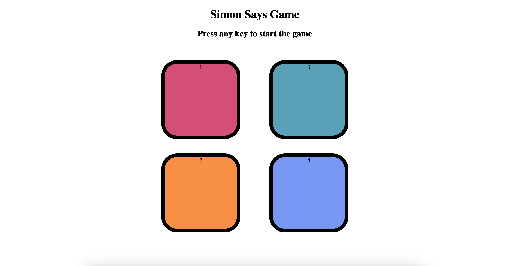

# Simon Says Game

This is a simple Simon Says game implemented using HTML, CSS, and JavaScript.

## Game Description

Simon Says is a classic memory game where the game generates a sequence of colors or sounds, and the player must repeat that sequence. As the game progresses, the sequences become longer and more challenging.

## How to Play

1. Check out the live demo of the Simon Says game [here](https://santacionx.github.io/simonsGame23/).
2. Click or tap any  button to begin the game.
3. Watch the sequence of colors generated by the game.
4. Repeat the sequence by clicking or tapping the colors in the same order.
5. If successful, the game continues with a longer sequence. If not, the game ends.

## Preview

## Technologies Used

- HTML
- CSS
- JavaScript

